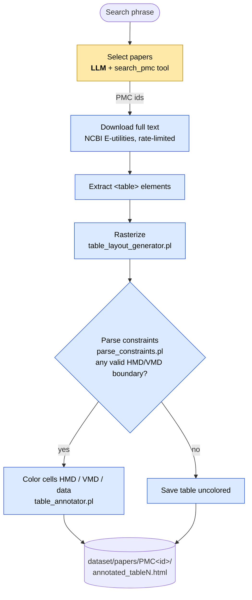

# Dataset Builder Agent

The dataset builder turns a search phrase into a set of scientific tables whose cells are labelled as **horizontal metadata (HMD)**, **vertical metadata (VMD)** or **data**. It is a DeepClause (DML) agent: a Prolog program in which a language model performs one narrow step and logic performs the rest.

## What it does

Given a phrase such as `"dementia with lewy bodies"`, the agent:

1. **Selects papers.** Claude searches PubMed Central through one tool, `search_pmc`, and picks up to 20 open-access papers. It sees only short result lines (id, date, journal, title).
2. **Downloads the full text** of each paper as XML from NCBI's public API, pausing and retrying when NCBI's rate limit is reached.
3. **Extracts every `<table>` element** and lays it out as a *raster*: a grid in which each slot holds the id of the cell covering it, so merged cells span several slots (`table_layout_generator.pl`). Untrusted spans and raster dimensions are checked against explicit per-table and per-paper resource budgets before full grid materialization; oversized papers fail with a structured error rather than consuming unbounded memory.
4. **Finds the header boundaries.** Every candidate pair (HMD boundary row, VMD boundary column) is tested against the seven parse constraints; the pairs that satisfy all of them are kept (`parse_constraints.pl`).
5. **Annotates the table.** For each valid pair the original table is colored: HMD cells green, VMD cells blue, data cells gray (`table_annotator.pl`).
6. **Saves the result** as `dataset/papers/PMC<id>/annotated_tableN.html`, with `metadata.json` for the article title, table counts, and JATS label/caption/footnote context with source paths and original unannotated table markup. Outputs are staged and replaced per PMC ID to avoid title collisions and stale tables.

Steps 2–6 run inside DeepClause's own Prolog engine and never involve the model.

## Workflow

Yellow is the only step that uses the language model; blue steps are deterministic Prolog.

## Advantages of the parse constraints in this workflow

- **No model cost for the hard part.** Deciding where a table's headers end is done by logic, so the model never reads a table. A 20-paper run that produced 38 tables used about 16,600 tokens (roughly $0.06), all of it spent choosing papers.
- **Deterministic and repeatable.** The same table always yields the same boundaries. Labels do not drift between runs, which matters when the output is training or evaluation data.
- **It declines rather than guesses.** A table with no boundary satisfying all seven constraints is saved uncolored instead of being given a plausible-looking but unsupported labelling. In the 20-paper run this happened for 1 of 38 tables.
- **Every decision is explainable.** A rejected boundary can be traced to the first constraint it violates (`omni_validate/4`), so a wrong or missing annotation can be diagnosed rather than merely observed.
- **Content-independent.** The constraints look only at the table's structure (which slots belong to the same merged cell), not at its text. They apply unchanged across subjects, languages and vocabularies.
- **Merged cells are evidence, not noise.** Row and column spans, which make tables hard for text-based methods, are exactly what the constraints reason about.
- **Boundary checking is indexed.** Adjacent-cell relationships and hierarchy witnesses are summarized once per raster, then boundary candidates use those summaries rather than rescanning rows and columns. A separate resource budget prevents excessive candidate-label output; performance should be measured on representative tables rather than assumed.
- **Ambiguity is preserved.** When more than one boundary pair is valid, all are reported, leaving the choice to a later stage instead of hiding it.

## Limits observed

Tables published as images cannot be extracted, and the agent only reaches papers whose full text NCBI makes available as XML.

### PMC download and XML integrity (F07/F08)

PMC eFetch payloads are parsed as **JATS XML**, using SWI's XML dialect with
parser diagnostics treated as errors. Standalone HTML helpers remain tolerant
of loose HTML. The parser normalizes qualified JATS element names before
extracting and rasterizing `<table>` elements; it does not change the
semantics of the seven boundary constraints. Before publishing a paper,
`process_paper/4` requires exactly one JATS article and a matching `pmc`
`article-id` inside `<front><article-meta>`. A genuine, well-formed paper
with no tables may still produce a complete zero-table result.

`download_status/3` distinguishes accepted ESearch/ESummary JSON, accepted
JATS XML, rate-limited/transient error bodies, and invalid/empty/nonarticle
responses. `ncbi_fetch` retries only known transient bodies, with bounded
retries. Invalid responses cannot publish a paper. The DeepClause
`url_fetch` API in use does **not** expose HTTP headers/status to this DML
code; status/content-type checks at the transport layer remain a follow-up
for the fetch adapter. The local, network-free regression suite is
`src/download_xml_regression_tests.pl` (also included in
`src/run_regression_tests.sh`).

### Machine-readable output (F10)

The canonical output is now `papers/PMC<id>/tables.jsonl`, with one JSON record for each table containing its raster, source cell XPaths, stable candidate IDs, labeled regions and explicit abstention. `annotated_tableN.html` remains an optional inspection view with candidate/boundary headings. `metadata.json` records schema/linkage, source JATS context and per-table candidate counts. Staging verifies the JSONL/metadata count and identity consistency before publishing. Synthetic padding cells have null source paths, and merged cell labels follow their top-left raster slot.

### Boundary scalability (F11)

`valid_boundaries/2` now precomputes adjacency summaries and maintains the same
ordered set of accepted boundaries as the original seven predicates. The
inspection renderer reuses the input raster and writes HTML candidates one at a
time. Full per-candidate labels in `tables.jsonl` remain potentially quadratic
in table size and candidate count, so attempts requiring more than 500,000
cell-label records raise a typed output-limit error before writing HTML.
The paper-staging mechanism preserves any previously published version.
`src/boundary_scaling_regression_tests.pl` contains native differential and
rendering tests; `tools/verify_fast_boundary_logic.py` provides an independent
formula replay. Native Prolog tests and benchmarks require SWI-Prolog.
